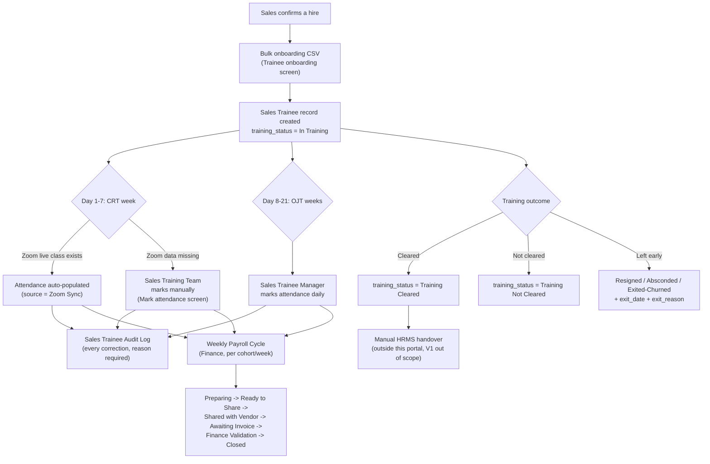
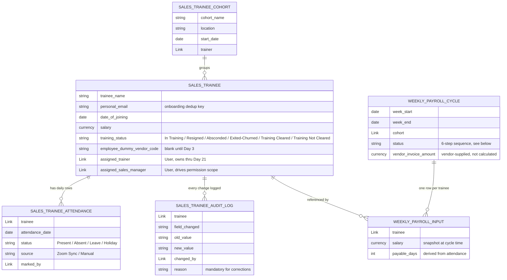
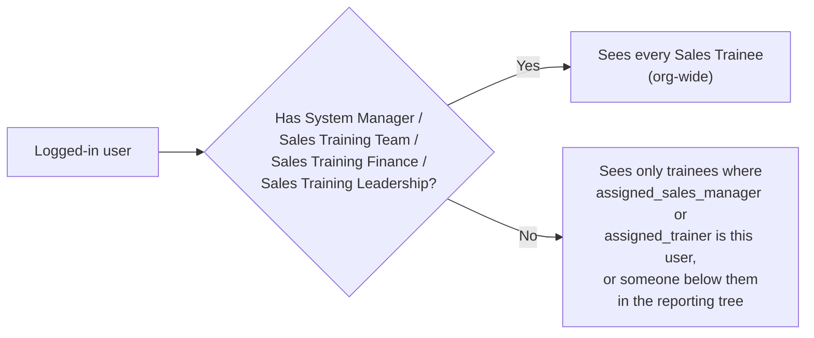
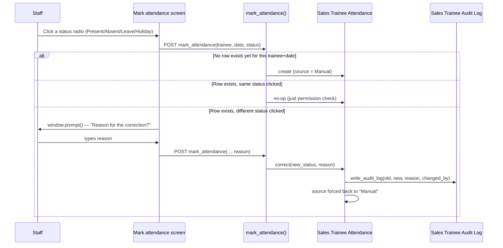
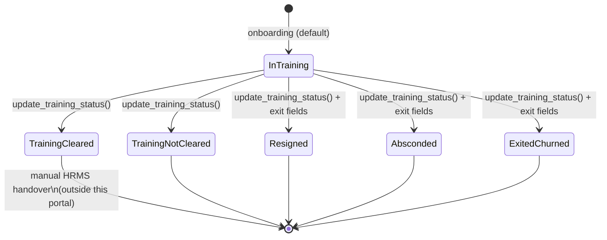
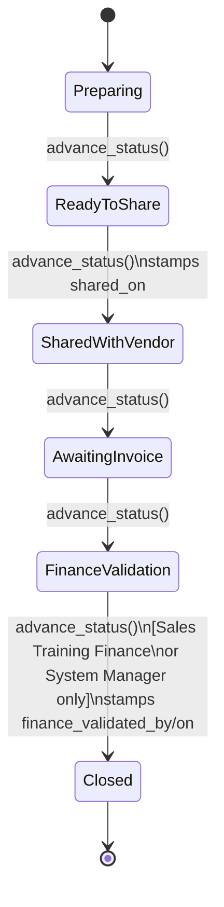

# Consumer Sales Training & Third-Party Payroll Tracker — Team Guide

Branch: `feature/consumer-sales-training-payroll-tracker` · App: `lms` (this repo) · Source requirement: [Consumer Sales Training & Third-Party Payroll Tracker](https://infinitylearn.atlassian.net/wiki/spaces/~7120200816e36e73d440c6982689ec4e171458/pages/2901409801/) (Confluence MoM) · Full architecture spec: [`docs/superpowers/specs/2026-09-24-consumer-sales-training-payroll-tracker-design.md`](superpowers/specs/2026-09-24-consumer-sales-training-payroll-tracker-design.md)

**In two sentences:** Sales hires a Consumer Sales (Academic Counsellor) trainee and, before that person exists anywhere else in our systems, Training/Sales staff log them here on Day 1 — no login for the trainee, no HRMS record yet. Over the next 21 days staff mark attendance, change training status, and Finance runs a weekly payroll cycle against a third-party vendor, all from one screen instead of Excel + WhatsApp.

---

## 1. Where it lives

New screens live inside the existing LMS Vue app, under the **Sales Trainee** section of the sidebar (visible to staff roles, not learners):

| Sidebar label | Route | Component |
|---|---|---|
| Trainee onboarding | `/sales-trainees/import` | [`TraineeImport.vue`](../frontend/src/pages/Sales/TraineeImport.vue) |
| Trainees | `/sales-trainees` | [`TraineeList.vue`](../frontend/src/pages/Sales/TraineeList.vue) |
| (cohorts, linked from Trainees) | `/sales-trainees/cohorts` | [`TraineeCohortList.vue`](../frontend/src/pages/Sales/TraineeCohortList.vue) |
| Mark attendance | `/sales-trainees/attendance` | [`TraineeAttendance.vue`](../frontend/src/pages/Sales/TraineeAttendance.vue) |
| Payroll cycles | `/sales-trainees/payroll` | [`WeeklyPayrollCycle.vue`](../frontend/src/pages/Sales/WeeklyPayrollCycle.vue) |
| Trainee dashboard | `/sales-trainees/dashboard` | [`TraineeDashboard.vue`](../frontend/src/pages/Sales/TraineeDashboard.vue) |

No new service, no new database — everything is new Frappe DocTypes inside this app, reusing its existing permission engine, Vue shell, and one deploy pipeline.

---

## 2. The trainee journey, end to end

The trainee **never logs in**. Everything above is staff acting on the trainee's behalf — that's a deliberate scope decision (§7 of the design spec), not a gap.

---

## 3. Data model

**Deliberately not built:** a pro-rata salary formula. `Weekly Payroll Input` captures `payable_days` and `salary`; Finance reconciles that against whatever the vendor invoices, by eye. The Confluence doc's own open item #6 says the formula isn't defined yet — building one now would mean coding a guess.

---

## 4. Roles & who can do what

| Role | Sees | Can do |
|---|---|---|
| **System Manager** | Everything (Super Admin tier) | Everything |
| **Sales Training Team** | Every trainee, org-wide | Bulk onboarding, CRT-week attendance fallback, org-wide reports |
| **Sales Trainee Manager** | Only trainees where they are `assigned_sales_manager` / `assigned_trainer`, or are above that person in the reporting-line tree | Mark/correct OJT-week attendance, change training status for their own trainees |
| **Sales Training Finance** | Every payroll cycle, org-wide | Validate and close weekly payroll cycles, run finance reports |
| **Sales Training Leadership** | Every trainee/report, org-wide | Read-only — dashboards and reports |

Visibility is **not** a hardcoded list — it's computed per request in [`trainee_scope.py`](../backend/lms/lms/trainee_scope.py), reusing the same reporting-tree recursion (`access.py::reporting_tree`) already used elsewhere in this app for manager-scoped access. A manager's tree changes automatically as `LMS Reporting Line` changes; nothing needs to be re-wired per trainee.

One important nuance: **both** Sales Training Team and Sales Trainee Manager have write access to attendance. There's no hard permission gate that switches ownership at Day 22 — it's a workflow convention (who staff put in `assigned_trainer` vs `assigned_sales_manager`), not code enforcement. Training Team is expected to only touch CRT-week fallback marking in practice.

---

## 5. Attendance — how marking and correction actually work

Two details worth knowing if you're debugging attendance data:

1. **A correction always sets `source = Manual`**, even if the original row came from Zoom. This is intentional — without it, the next Zoom sync for the same trainee+date would silently overwrite the correction on its next run.
2. **A reason is mandatory** for any correction, enforced server-side in `correct()`. It's not just a UI nicety — calling the API directly without one throws `MandatoryError`.

### CRT-week attendance currently has no live Zoom feed

The design intent (§2, §6 of the spec) was: CRT week (Days 1–7) auto-populates from the existing Zoom live-class attendance sync, the same one used for regular LMS batches. In practice, that sync (`trainee_attendance_sync.py::sync_from_live_class_participant`) fires off `LMS Live Class Participant.member`, which is a **mandatory Link → User** field — and `Sales Trainee` deliberately has no User account. So today, **CRT-week attendance also has to be marked manually** by Sales Training Team, same screen, same flow as OJT. This isn't a bug so much as an open question (confirmed with the team this session — see §6 below); the code path exists and will start working the moment trainees get a linked User, but nobody should assume Zoom is populating CRT attendance right now.

---

## 6. Training status lifecycle

Every transition goes through `SalesTrainee.update_training_status(new_status, reason, ...)`, which **requires a reason** and writes it to the audit log. A plain desk edit (`doc.save()` bypassing that method) still gets logged automatically via `on_update()` — but with a fallback reason `"No reason provided (direct edit)"` instead of a real one. Worth knowing: **the mandatory-reason rule only applies through the intended method**, not at the database layer — a script or raw API call that saves the document directly skips the reason requirement (it still shows up in the audit log, just without a real explanation). Not exploitable by trainees or normal staff UI use, but worth keeping in mind if anyone builds a second entry point later.

---

## 7. Weekly payroll cycle

Rules baked into `WeeklyPayrollCycle.advance_status()`:
- **One step at a time.** You cannot jump from `Preparing` straight to `Closed` — the code rejects any skip.
- **Closing is gated.** Only `Sales Training Finance` or `System Manager` can move a cycle to `Closed`; anyone else attempting it gets a `PermissionError`.
- **Corrections don't get blocked by a closed cycle.** `Sales Trainee Attendance.correct()` explicitly works even after the owning cycle is `Closed` — Finance reconciles from the audit trail rather than being locked out of ever fixing a mistake after close.
- **No pro-rata math anywhere in this flow.** `prepare_weekly_inputs()` snapshots `salary` and computes `payable_days` from attendance; the vendor's own `vendor_invoice_amount` is captured as-is for Finance to compare by eye, not validated against a formula.

---

## 8. Bulk onboarding

Modeled on the existing `ojt_certification.py` CSV importer, not the CRT curriculum importer (a closer match — per-person rows with dedup, not a course schedule):

- **Dedup key:** `personal_email`, case-insensitive.
- **Dry-run first:** every upload validates (missing mandatory fields, duplicate rows) before anything is written — same UX as the existing OJT importer.
- **Upsert-by-key, never delete-then-reinsert:** re-uploading a trainee updates their existing record in place.
- **Access:** `Sales Training Team` or `System Manager` only (`sales_trainee_import.py::_ensure_import_access`).

---

## 9. Reports & dashboard

`TraineeDashboard.vue` calls `trainee_dashboard.get_dashboard_summary(month, location, cohort)` for headline numbers, and `trainee_cohort_stats.py` for per-cohort breakdowns and a "who's missing attendance today" list — useful for a manager doing a daily sweep.

`trainee_reports.py` exports (CSV/XLSX via the existing `openpyxl` dependency), matching the Confluence doc's report list verbatim:

| Export | What it answers |
|---|---|
| `export_active_trainees_csv` | Who's currently In Training, by cohort/location |
| `export_weekly_attendance_payroll_report` | Attendance + payroll-eligible days for a given week |
| `export_vendor_payroll_input` | What to hand the vendor for a given cycle |
| `export_exit_churn_report` | Who left, when, why |
| `export_training_outcome_report` | Cleared vs Not Cleared, by cohort |
| `export_location_cohort_report` | Headcount by location × cohort |
| `export_finance_reconciliation_report` | Our numbers vs the vendor's invoice, side by side |

All gated to `Sales Training Team` / `Sales Trainee Manager` (their own scope) / `Sales Training Finance` / `Sales Training Leadership` / `System Manager` — never open to an arbitrary logged-in user.

---

## 10. What the Confluence doc asked for vs what's built

| Confluence area | Status | Note |
|---|---|---|
| Trainee tracking from Day 1, independent of employee code | ✅ Built | `Sales Trainee` is standalone — no User/employee-code dependency to exist |
| Attendance for CRT + OJT (21 days) | ✅ Built, ⚠️ caveat | Single ledger works for both; **CRT auto-sync from Zoom is not live yet** (§6 above) — mark manually for now |
| Training status + exit tracking | ✅ Built | Full lifecycle + audit trail |
| Weekly payroll cycle with Finance sign-off | ✅ Built | Sequential status machine, Finance-gated close |
| Payroll pro-rata calculation | ❌ Not built, by design | Confluence's own open item #6 — formula undefined; vendor calculates, we capture and reconcile |
| Cohort management | ✅ Built | Kept per team decision this session (see below) |
| Bulk onboarding | ✅ Built | CSV/Sheet, dedup + dry-run |
| Reports (attendance, payroll, outcome, finance reconciliation, etc.) | ✅ Built | 7 exports, listed above |
| Trainee login / self-service | 🚫 Out of scope (V1) | Confirmed explicit exclusion in the source doc |
| Biometric / punch / geo attendance | 🚫 Out of scope (V1) | Confirmed explicit exclusion |
| Direct salary disbursement | 🚫 Out of scope (V1) | Vendor pays; we don't move money |
| Month-2 conversion to real HRMS/User record | 🚫 Out of scope (V1) | Manual step outside this portal, not in the source doc's V1 scope |
| Employee/dummy vendor code enforcement by Day 3 | ✅ Field exists, ⚠️ not enforced | Kept as free-text, no system deadline gate — team decision this session (below) |
| Report templates matching a specific vendor format | ✅ Built, using generic templates | Vendor's actual template wasn't available; generic CSV/XLSX shape used, can be reshaped once vendor template lands |

### Decisions made this session (where the Confluence doc left things open)

The source doc lists 10 items still pending Sales/Finance validation (§8/§9 of the design spec) and explicitly says prototype-build doesn't wait on that validation. Four of those were resolved with Vijay directly while cross-checking build vs doc:

1. **CRT attendance stays on existing Zoom sync design** (even though it's not live yet in practice, per §6) — no new manual-only workflow was substituted; the Zoom path is the intended long-term fix once trainees have linked User accounts.
2. **Cohort management stays as built** — not stripped out, even though the Confluence doc questioned whether it was needed.
3. **Report templates stay generic** — the vendor's actual template format wasn't available at build time; current exports are a reasonable default, ready to be reshaped later.
4. **Employee/dummy vendor code field stays free-text**, no Day-3 system enforcement — matches the doc's own uncertainty about who owns assigning it.

---

## 11. Quick reference — whitelisted API methods

For anyone extending this feature:

| Method | File | Purpose |
|---|---|---|
| `SalesTrainee.update_training_status` | `doctype/sales_trainee/sales_trainee.py` | The only path that should change training/exit status |
| `SalesTraineeAttendance.correct` | `doctype/sales_trainee_attendance/sales_trainee_attendance.py` | Audited status correction |
| `mark_attendance` | same file | Entry point the UI calls; decides mark vs correct server-side |
| `import_sales_trainees` | `sales_trainee_import.py` | Bulk onboarding, dry-run + upsert |
| `WeeklyPayrollCycle.advance_status` | `doctype/weekly_payroll_cycle/weekly_payroll_cycle.py` | One-step-at-a-time cycle progression |
| `prepare_weekly_inputs` | `trainee_payroll.py` | Snapshots salary + payable_days into a cycle |
| `get_dashboard_summary` | `trainee_dashboard.py` | Headline dashboard numbers |
| `get_cohort_stats` / `list_missing_attendance` | `trainee_cohort_stats.py` | Per-cohort breakdown, daily attendance gaps |
| `export_*` (7 methods) | `trainee_reports.py` | CSV/XLSX report exports |

Permission scoping for all of the above funnels through [`trainee_scope.py`](../backend/lms/lms/trainee_scope.py) (`sales_trainee_query_conditions`, `sales_trainee_attendance_query_conditions`, `sales_trainee_has_permission`) — start there if a report or list is showing the wrong set of trainees for a role.
